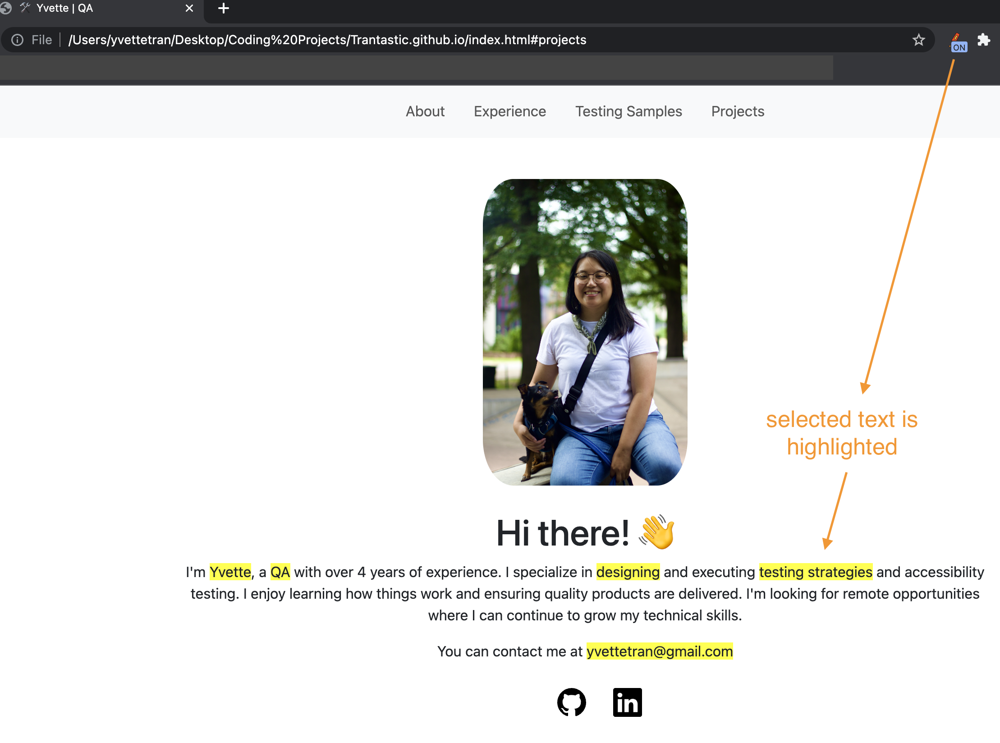

# highlighter
Chrome extension for highlighting text on a webpage. I built this for my job search to easily scan for key words in job descriptions. This works by lefting clicking on the mouse to select the text to highlight.

Turning off the extension or refreshing page removes the highlights.

